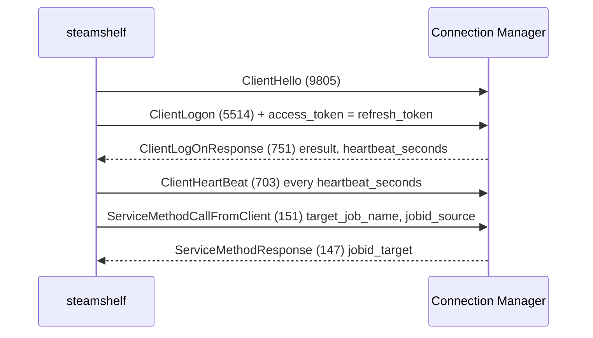

# CM Frame Protocol

`src/steamshelf/cm.py`. The websocket transport is deliberately the one we chose:
TLS supplies encryption, so there is no AES handshake to implement, unlike the
raw TCP CM protocol.

## Framing

One websocket binary frame carries exactly one Steam message:

```
uint32  emsg | 0x80000000     # PROTO_MASK set => protobuf header follows
uint32  header_length
bytes   CMsgProtoBufHeader
bytes   message body
```

```python
def _send(self, emsg, header, body):
    head = wire.encode(header, HEADER)
    frame = struct.pack("<II", emsg | PROTO_MASK, len(head)) + head + body
    with self._lock:
        self._ws.send_binary(frame)
```

## Invariant: not every message is protobuf

Steam still emits a few pre-protobuf, struct-framed messages. They lack
`PROTO_MASK` and carry a fixed binary header instead. **Parsing one as protobuf
yields garbage**, which is exactly how this first failed:

```
ValueError: unsupported wire type 7 for field 4391314241931494515196546846636405424127
```

`_parse_frame` returns `None` for them and every caller drops them. steamshelf
needs none of these messages.

```python
@staticmethod
def _parse_frame(data):
    if len(data) < 8 or not struct.unpack_from("<I", data, 0)[0] & PROTO_MASK:
        return None
    raw_emsg, head_len = struct.unpack_from("<II", data, 0)
    if head_len > len(data) - 8:
        return None
    return (raw_emsg & ~PROTO_MASK,
            wire.decode(data[8:8 + head_len], HEADER),
            data[8 + head_len:])
```

## Multi envelopes

`EMSG_MULTI` (1) wraps a batch. Its body is `CMsgMulti`; when `size_unzipped` is
non-zero, `message_body` is gzip-compressed. The payload is a run of
`<uint32 length><frame>` records. `_messages()` flattens these so callers see a
flat stream, and applies the same non-proto filter to each inner frame.

## Logon sequence



Key details:

- The **refresh token** goes in `CMsgClientLogon.access_token` (field 108). The
  field name is misleading; a web access token will not work here.
- The token must be a **SteamClient-platform** token. A WebBrowser-platform token
  cannot log on to a CM. See [../steam-auth/credential-login.md](../steam-auth/credential-login.md).
- The header's `steamid` is the real account's; `client_sessionid` starts at 0 and
  the response header carries the assigned one.
- A daemon thread sends heartbeats. Without them the CM drops the session.
- Responses are correlated by `jobid_source` -> `jobid_target`, so a call ignores
  unrelated traffic on the stream.

## EMsg values used

| Name | Value |
|---|---|
| `Multi` | 1 |
| `ServiceMethodResponse` | 147 |
| `ServiceMethodCallFromClient` | 151 |
| `ClientHeartBeat` | 703 |
| `ClientLogOnResponse` | 751 |
| `ClientLoggedOff` | 757 |
| `ClientLogon` | 5514 |
| `ClientHello` | 9805 |

## Connecting

Server list comes from `ISteamDirectory/GetCMListForConnect` with
`cmtype=websockets`, sorted by `wtd_load`. `connect()` takes the top 24 and
tries each in turn, then repeats the whole list up to three times with a
15/30-second backoff.

The limit matters more than it looks. At 8 the list is usually a single
datacentre - every endpoint `cmp{1,2}-atl3` - so there is no real diversity to
fall back on. At 24 it spans several.

**Steam returns 502 across its entire fleet from time to time.** Observed twice
in one evening, once for long enough to outlast three rounds of backoff, then
clear within minutes. Treat a fleet-wide 502 as transient and retryable, not as
a bug in the handshake: the Origin header, User-Agent and port make no
difference, and a bare handshake fails identically during a window.

This is worth waiting out because a sweep that has reached the upload step has
an hour of scraping behind it. When it still fails, the cache makes the re-run
cheap - see [../metadata/caching.md](../metadata/caching.md).

Related: [wire-codec.md](wire-codec.md), [cloudconfigstore.md](cloudconfigstore.md)
