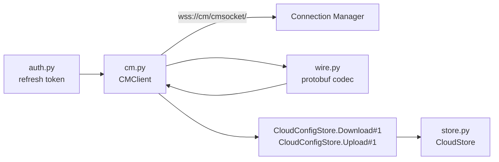

# CM Client

Steam's collection store lives behind `CloudConfigStore`, a service that is only
reachable over a Connection Manager session. Everything in this directory exists
because of that one fact.

## Why not the Web API

This was checked empirically, and the answer is not obvious from Steam's docs:

| Request | Result |
|---|---|
| `POST api.steampowered.com/ICloudConfigStore/Download/v1/` | `404` - `Interface 'ICloudConfigStore' not found` |
| `POST api.steampowered.com/ICloudConfigStore/Upload/v1/` | `404` |
| `GET api.steampowered.com/IPlayerService/GetOwnedGames/v1/` | `401` |

A `401` means "exists, authenticate"; the `404` is Steam saying the interface is
not published on that host at all. Adding an `access_token` does not change it.
`IStoreBrowse/GetItems` is absent for the same reason, which is why metadata is
scraped one app at a time - see [../metadata/steam-storefront.md](../metadata/steam-storefront.md).

## Files

| File | Contents |
|---|---|
| [frame-protocol.md](frame-protocol.md) | Websocket framing, logon, Multi envelopes |
| [wire-codec.md](wire-codec.md) | The hand-rolled protobuf codec and its schemas |
| [cloudconfigstore.md](cloudconfigstore.md) | Download/Upload semantics and versioning |

Related: [../steam-auth/summary.md](../steam-auth/summary.md),
[../collections/summary.md](../collections/summary.md)
