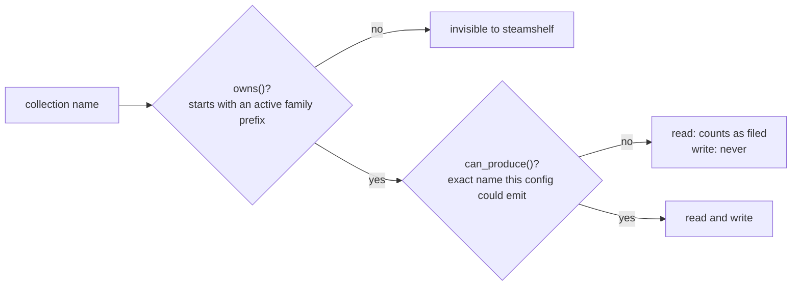

# Naming and Ownership

The rule that stops a run from quietly destroying data.

## Names reproduce Depressurizer

Default format is `({prefix}) {value}`:

```
(HLTB)  0-5     (HLTB)  5-10    (HLTB) 10-20    (HLTB) 20-50    (HLTB) 50+
(Platform) Windows   (Platform) Mac   (Platform) Linux
(Score) Very Positive   (Score) Mixed   (Score) Unrated
(Deck) Verified   (Deck) Playable   (Deck) Unsupported
```

Two details are load-bearing and easy to break:

- The HLTB labels carry a **leading space** (`" 0-5"`, `" 5-10"`) so collections
  sort numerically in the Steam client. `(HLTB) 0-5` with one space is a
  *different collection* from `(HLTB)  0-5`.
- Platform uses **`Mac`**, not `macOS`, because that is what Depressurizer wrote.

Changing `name_format` or these labels strands every existing collection. Treat
them as a compatibility contract, not a style choice.

## Two levels of ownership



```python
config.owns("(Platform) SteamOS")         # True  - shares the platform prefix
config.can_produce("(Platform) SteamOS")  # False - we never emit "SteamOS"
config.can_produce("(Platform) Linux")    # True
config.owns("Favorites")                  # False
```

**Why both.** A real library carries collections from earlier tools that share a
prefix but not a vocabulary - `(Platform) SteamOS` is a Depressurizer artefact
with hundreds of games in it. Treating prefix-match as write permission would let
a reconciliation pass empty it, because no game ever yields "SteamOS". So
`owns()` governs *reading* - the game is filed, don't re-file it - and
`can_produce()` governs *writing*.

`GamePlan.removals()` enforces this:

```python
if family and self.desired.get(family) is not None and config.can_produce(name):
    stale.add(name)
```

## Families

`hltb`, `platform`, `rating`, `deck`, `year`, all on by default. `deck` is new
relative to Depressurizer; `year` reproduces its `(Year) 2019` collections.

Depressurizer also left a **bare `(Year)`** collection - its "could not date
this" bucket. The family prefix carries a trailing space, so `"(Year)"` does not
even match `owns()`: it is neither read as filing nor ever written to. Games in
it that can now be dated join a proper `(Year) 2013` and stay in the bare one as
well, so it is worth deleting by hand once.

`known_labels(family)` enumerates what a family can emit - bucket labels for
`hltb`, Steam's nine review tiers plus `Unrated` for `rating`, and so on. `year`
is the exception and is matched by regex (`(19|20)\d{2}`) or the literal
unknown label, since any four-digit year is legitimate.

Related: [collection-model.md](collection-model.md),
[../pipeline/selection-and-planning.md](../pipeline/selection-and-planning.md)
