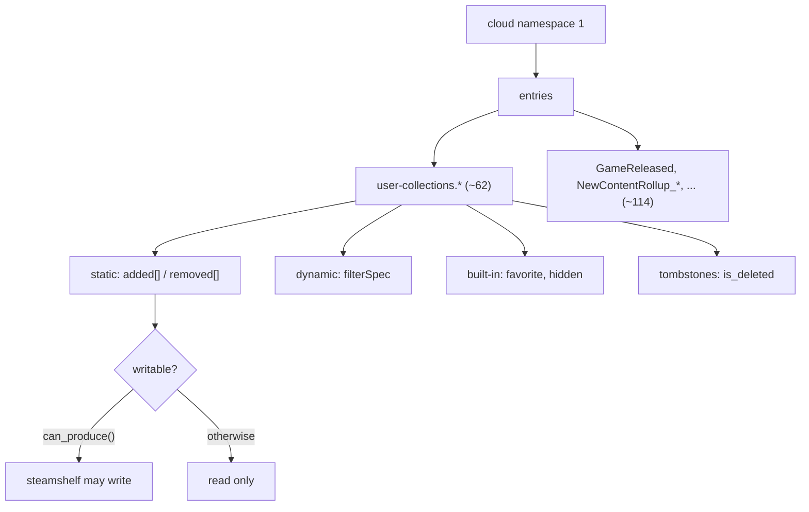

# Collections

What a Steam collection actually is, and the rules governing which ones
steamshelf may touch.

Only static, non-built-in, non-deleted collections are even candidates, and of
those only the ones this config could itself have created are writable. That
second rule is the important one and is explained in
[naming-and-ownership.md](naming-and-ownership.md).

## Files

| File | Contents |
|---|---|
| [collection-model.md](collection-model.md) | The JSON shape and its parsing |
| [naming-and-ownership.md](naming-and-ownership.md) | Depressurizer compatibility; owns vs can_produce |
| [local-mirror.md](local-mirror.md) | Reading collections without logging in |

Related: [../cm/cloudconfigstore.md](../cm/cloudconfigstore.md),
[../pipeline/summary.md](../pipeline/summary.md)
