# Lode Map

Index of all lode files. Start here.

```mermaid
flowchart TB
    ROOT["lode/"] --> S["summary.md"]
    ROOT --> T["terminology.md"]
    ROOT --> P["practices.md"]
    ROOT --> PL["plans/"]
    ROOT --> A["steam-auth/"]
    ROOT --> C["cm/"]
    ROOT --> CO["collections/"]
    ROOT --> M["metadata/"]
    ROOT --> PI["pipeline/"]
    A --> A1["credential-login"]
    A --> A2["token-lifecycle"]
    A --> A3["onepassword"]
    C --> C1["frame-protocol"]
    C --> C2["wire-codec"]
    C --> C3["cloudconfigstore"]
    CO --> CO1["collection-model"]
    CO --> CO2["naming-and-ownership"]
    CO --> CO3["local-mirror"]
    M --> M1["steam-storefront"]
    M --> M2["howlongtobeat"]
    M --> M3["caching"]
    PI --> PI1["selection-and-planning"]
    PI --> PI2["apply-and-safety"]
    PI --> PI3["cli"]
```

## Top level

| File | Contents |
|---|---|
| [summary.md](summary.md) | One-paragraph snapshot of the whole project |
| [terminology.md](terminology.md) | Steam's vocabulary and ours |
| [practices.md](practices.md) | Patterns this project holds to |
| [plans/roadmap.md](plans/roadmap.md) | Open work and pending decisions |
| `tmp/` | Session scraps. Git-ignored. |

## steam-auth/ - getting and keeping a token

| File | Contents |
|---|---|
| [steam-auth/summary.md](steam-auth/summary.md) | Domain overview |
| [steam-auth/credential-login.md](steam-auth/credential-login.md) | IAuthenticationService flow, RSA, Steam Guard |
| [steam-auth/token-lifecycle.md](steam-auth/token-lifecycle.md) | Refresh vs access tokens, storage, expiry |
| [steam-auth/onepassword.md](steam-auth/onepassword.md) | Reading credentials via the `op` CLI |

## cm/ - the connection manager client

| File | Contents |
|---|---|
| [cm/summary.md](cm/summary.md) | Why the Web API is not an option |
| [cm/frame-protocol.md](cm/frame-protocol.md) | Websocket framing, logon, Multi envelopes |
| [cm/wire-codec.md](cm/wire-codec.md) | The hand-rolled protobuf codec; where schemas come from |
| [cm/cloudconfigstore.md](cm/cloudconfigstore.md) | Download/Upload semantics and versioning |

## collections/ - what we are actually editing

| File | Contents |
|---|---|
| [collections/summary.md](collections/summary.md) | Domain overview |
| [collections/collection-model.md](collections/collection-model.md) | JSON shape, parsing, invariants |
| [collections/naming-and-ownership.md](collections/naming-and-ownership.md) | Depressurizer naming; owns vs can_produce |
| [collections/local-mirror.md](collections/local-mirror.md) | The on-disk copy, and the sharedconfig.vdf dead end |

## metadata/ - the two scrapers

| File | Contents |
|---|---|
| [metadata/summary.md](metadata/summary.md) | Domain overview |
| [metadata/steam-storefront.md](metadata/steam-storefront.md) | appdetails, appreviews, Deck, rate limits |
| [metadata/howlongtobeat.md](metadata/howlongtobeat.md) | Init-token dance, title matching |
| [metadata/caching.md](metadata/caching.md) | Scopes, TTLs, negative caching |

## pipeline/ - selection through upload

| File | Contents |
|---|---|
| [pipeline/summary.md](pipeline/summary.md) | Domain overview |
| [pipeline/selection-and-planning.md](pipeline/selection-and-planning.md) | What "uncategorized" means; building a plan |
| [pipeline/apply-and-safety.md](pipeline/apply-and-safety.md) | Re-read, snapshot, confirm, upload |
| [pipeline/cli.md](pipeline/cli.md) | Commands, flags, error style |
