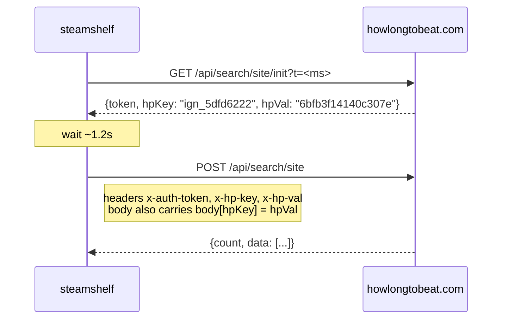

# HowLongToBeat

`src/steamshelf/hltb.py`. No public API; this reproduces what the site's own
search box does.

## The request



The key/value pair goes in **both** the headers and the request body. The token
decodes to `<timestamp_ms>::<ip>|<user-agent>|<hpKey>|<hmac>`, so it is bound to
the client's IP and UA - the same UA must be used for init and search.

## Invariant: let the token settle

A token used the instant it is issued is usually rejected with
`403 {"error":"Session expired or invalid fingerprint"}`. Measured over four
attempts each:

| Delay after init | Successes |
|---|---|
| 0 s | 1 / 4 |
| 1 s | 4 / 4 |
| 3 s | 3 / 4 |

`TOKEN_SETTLE = 1.2` seconds after every init, and the token is then reused for
`TOKEN_TTL = 240` seconds. Reusing an aged token is markedly more reliable than
minting a fresh one per search.

`SEARCH_ATTEMPTS = 4`; the first retry reuses the token (these 403s are
transient), later ones force a fresh session.

## Times are in seconds

`comp_main`, `comp_plus`, `comp_100`, `comp_all` are seconds. Portal 2's
`comp_main` is `30924` = 8.6 hours. Divide by 3600.

## release_world is the original release year

Search rows carry `release_world`, the worldwide release year, which is the
right source for the `year` family - Steam's `release_date` gives the store
listing date instead. It lands on `HltbResult.release_year`.

Because it lives on the cached `HltbResult`, adding it meant clearing the `hltb`
cache scope and re-running; entries cached before it existed decode with
`release_year = 0` and silently fall back to Steam's date. Worth remembering
whenever a field is added to a cached dataclass.

## Title matching

`profile_steam` is not present in search results, so matching is on normalized
titles. `normalize()` lowercases, drops apostrophes **without splitting the word**
(`Baldur's` -> `baldurs`, not `baldur s`, which broke the search), strips
trademark glyphs, a **parenthesised year**, and edition noise (`Game of the Year
Edition`, `Definitive`, `Director's Cut`, ...), then reduces to alphanumeric
tokens.

The parenthesised year is the subtle one. Steam lists `System Shock® 2 (1999)`;
left in, `1999` reads as a sequel marker, the guard below rejects HowLongToBeat's
`System Shock 2`, and the game lands in `(HLTB) Unknown` *and* gets its year from
Steam's 2013 listing date. Only parenthesised years are stripped - `FIFA 2003`
really is called that.

`title_similarity()` is `difflib` ratio plus one rule:

```python
shorter, longer = sorted((q_tokens, c_tokens), key=len)
if longer[:len(shorter)] == shorter and _sequel_markers(q) == _sequel_markers(c):
    score = max(score, 0.95)
```

One title being a leading run of the other scores 0.95 - HLTB lists
`Disco Elysium` where Steam says `Disco Elysium - The Final Cut`. The sequel-marker
guard (digits and roman numerals must agree) is what stops `Half-Life` matching
`Half-Life 2`. An exact match still scores 1.0 and wins.

Acceptance threshold is 0.72 plus a non-zero playtime; the winning score is kept
on the result as `confidence` and printed in verbose plans so matches are
auditable.

## Failure is not "unknown"

A transport failure must not be cached or turned into `(HLTB) Unknown`, because a
game with an Unknown bucket counts as filed and would never be reconsidered.
`lookup()` lets the error propagate; the engine drops the `hltb` family from that
game's plan entirely, so it keeps its current bucket and the next run retries it.

Related: [caching.md](caching.md),
[../pipeline/selection-and-planning.md](../pipeline/selection-and-planning.md)
