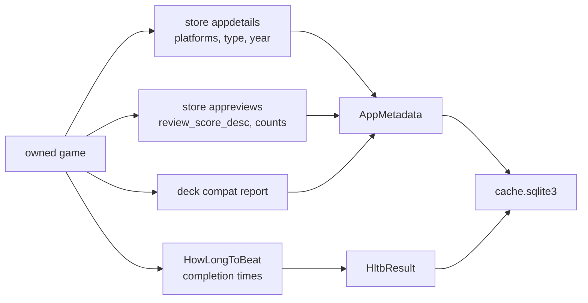

# Metadata

Where the three category dimensions come from, and why both sources are scrapes.

Neither Steam nor HowLongToBeat offers a supported bulk API to the open web, so
both are per-app, paced, and cached. A first full sweep of ~750 games takes
roughly an hour; subsequent runs are minutes.

## Files

| File | Contents |
|---|---|
| [steam-storefront.md](steam-storefront.md) | appdetails, appreviews, Deck, rate limits |
| [howlongtobeat.md](howlongtobeat.md) | The init-token dance and title matching |
| [caching.md](caching.md) | TTLs and what invalidation means here |

Related: [../pipeline/summary.md](../pipeline/summary.md)
