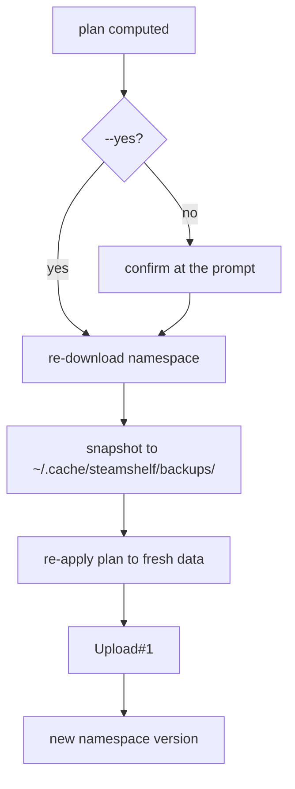

# Apply and Safety

`apply` writes to a live Steam account. Four things stand between a plan and
data loss.



## 1. The plan is shown first

Always, including under `--yes`. `plan` and `apply` print the identical summary:
per-collection `+n -n`, per-game detail under `-v`, and the skipped/retry counts.

## 2. Re-read immediately before writing

The plan may be an hour old by the time it is applied, and the running client may
have changed something. The downloaded namespace - not the one planning started
from - is what the deltas are applied to:

```python
raw = cloud.read_raw()
saved = store.write_snapshot(raw, store.snapshot_path(current.steamid))
fresh = CollectionSet.from_entries(raw["entries"], int(raw["version"]))
merged = engine.apply_plan(plan, fresh, rule_config)
version = cloud.write(merged, fresh.namespace_version)
```

This matters because an upload replaces a collection's JSON wholesale. Applying
deltas to stale data would drop games added in the interim.

## 3. Snapshot every time

The raw namespace dump goes to
`~/.cache/steamshelf/backups/collections-<steamid>-<timestamp>.json` before the
upload, and the path is printed. `steamshelf backup` writes the same thing on
demand. These are complete - every entry, not just collections - so a bad run can
be reconstructed by hand.

The local mirror at `userdata/<id>/config/cloudstorage/` is a second, free copy of
pre-run state; see [../collections/local-mirror.md](../collections/local-mirror.md).

## 4. can_produce gates every write

Covered in [../collections/naming-and-ownership.md](../collections/naming-and-ownership.md).
This is the rule that keeps a foreign `(Platform) SteamOS` collection intact.

## Known limitation

Steam being open during an apply is tolerated but not ideal: the client holds its
own cached view and can push it back. Closing Steam first is the safe play, and
the README says so. A single-game apply with Steam running was verified clean
(namespace 1181 -> 1182, exactly one new collection, no other diff), but that is
evidence, not a guarantee.

Related: [../cm/cloudconfigstore.md](../cm/cloudconfigstore.md)
