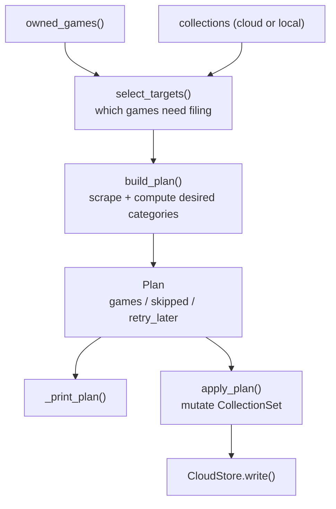

# Pipeline

From "753 owned apps" to "these collections changed".

`plan` and `apply` run the identical path; `plan` stops before `apply_plan`. That
symmetry is the point - a dry run is not an approximation of the real thing, it is
the real thing minus the write.

## Files

| File | Contents |
|---|---|
| [selection-and-planning.md](selection-and-planning.md) | What "uncategorized" means; how a plan is built |
| [apply-and-safety.md](apply-and-safety.md) | Re-read, snapshot, confirm, upload |
| [cli.md](cli.md) | Commands and flags |

Related: [../collections/summary.md](../collections/summary.md),
[../metadata/summary.md](../metadata/summary.md)
