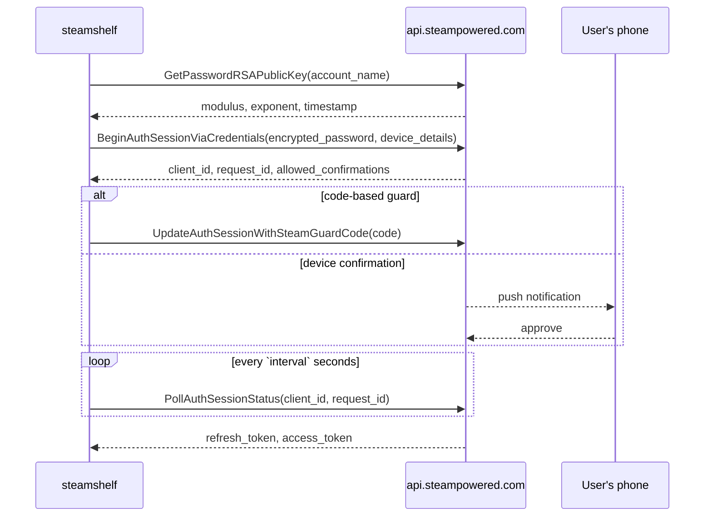

# Credential Login

`src/steamshelf/auth.py`. Steam's modern login, over plain HTTPS. No CM
connection is needed to get a token.



## Request encoding

Every method is `POST https://api.steampowered.com/IAuthenticationService/<Method>/v1/`
with the payload as a single form field:

```python
fields = {"input_json": json.dumps(payload)}
```

`input_json` accepts nested messages, which matters because `device_details` is a
submessage. Form-encoded scalars alone cannot express it.

## Password encryption

RSA PKCS#1 v1.5, done with `pow()` and `os.urandom` - no crypto dependency:

```python
block = b"\x00\x02" + nonzero_padding + b"\x00" + password.encode()
cipher = pow(int.from_bytes(block, "big"), exponent, modulus)
```

The padding bytes must all be non-zero. The key is short-lived and per-account;
`encryption_timestamp` from the key response must be echoed back.

## Invariant: platform type must be SteamClient

```python
"platform_type": 1,  # k_EAuthTokenPlatformType_SteamClient
"device_details": {"platform_type": 1, "os_type": -203, "gaming_device_type": 1},
```

A `WebBrowser` (2) token works for the Web API but **cannot log on to a CM**,
which would silently break collection access. A SteamClient token does both, so
one login covers everything.

## Steam Guard

`allowed_confirmations` says what the account permits:

| Type | Value | Handling |
|---|---|---|
| Email code | 2 | prompt the user, `UpdateAuthSessionWithSteamGuardCode` |
| Device code (authenticator) | 3 | same |
| Device confirmation | 4 | no code; just poll until approved |
| Email confirmation | 5 | no code; just poll |

When device confirmation is offered it is preferred over any code type, because
it needs no input. Polling has a 180-second deadline.

## Failure reporting

A failed service call returns `{"response": {}}` with HTTP 200; the real status is
in the `x-eresult` header. `_describe()` maps the common ones (5 InvalidPassword,
84 RateLimitExceeded, 85 AccountLoginDeniedNeedTwoFactor). Missing `client_id` in
the Begin response means bad credentials or rate limiting, and is reported as such.

Related: [token-lifecycle.md](token-lifecycle.md), [onepassword.md](onepassword.md)
