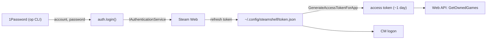

# Steam Auth

Getting a token that can both call the Web API and log on to a CM, without ever
storing a password.

## Files

| File | Contents |
|---|---|
| [credential-login.md](credential-login.md) | The login flow and Steam Guard |
| [token-lifecycle.md](token-lifecycle.md) | What is stored, renewed and expired |
| [onepassword.md](onepassword.md) | How credentials are read |

Related: [../cm/frame-protocol.md](../cm/frame-protocol.md)
